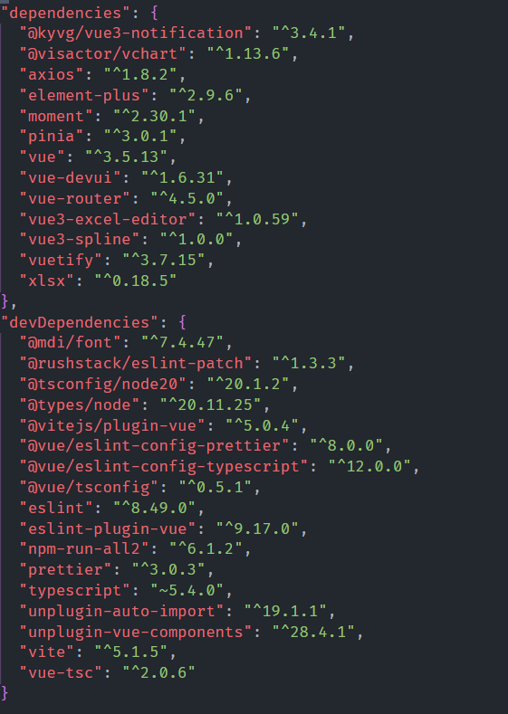
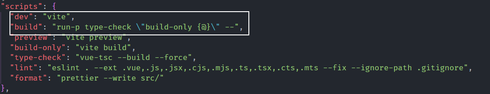

# swms-frondEnd

## 技术栈及部分框架

- Front-end：Vue3 + Pinia + vue-router
- ExcelPlugins：vue3-excel-editor
- UI Components：Vuetify + Element Plus

具体版本：



## 启动

本项目采用`yarn`而非`npm`管理，因此需要启动代码稍有不同

启动：

```bash
yarn run dev
# 完全开放
yarn run dev --host
```

构建：

```bash
yarn build
```



## 项目地址

项目地址:

1. [CodeBerg-SWMS](https://codeberg.org/SWMS/swms-web)
2. [GitCode-SWMS](https://gitcode.com/SWMS/swms-frontend)(`这里`)

联系方式：

- QQ：`1241142935`
